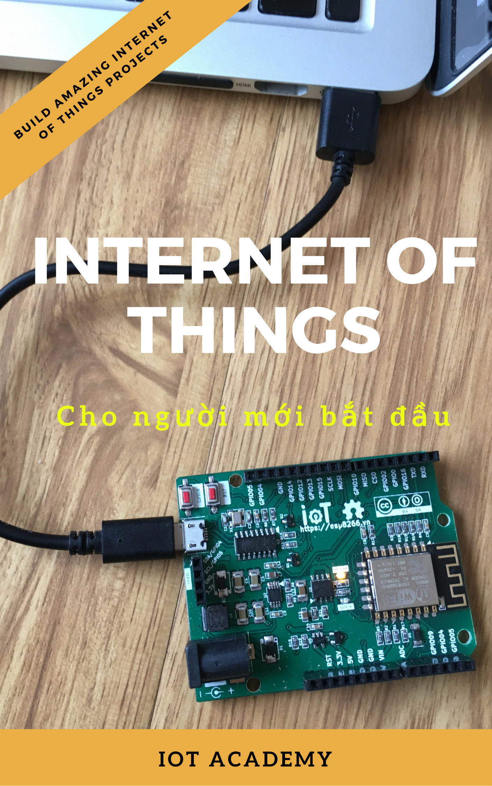

:doctype: book
:toc: macro
:toclevels: 2
:producer: Asciidoctor
:keywords: IoT, ESP8266, IoTs, WoT
:copyright: @2017 IoT Maker VietNam
:author: IoT Maker Việt Nam
:version: v1.0
:icons: font
:username: tuanpm
:pdf-stylesdir: themes/pdf
:pdf-style: basic
:source-highlighter: highlightjs
:imagesdir:
:front-cover-image: 
// :render-svg            : true
// :page-background-image : image:esp8266_soc.png[]
ifdef::backend-pdf[]
// :title-logo-image      : image:tuanpm.jpg[pdfwidth=4.25in,align=center]
:source-highlighter: pygments
:pygments-style: manni
:pygments-linenums-mode: inline
// :source-highlighter    : coderay
// :rouge-style           : github
endif::[]
:bg : {mask}
:hide-uri-scheme:
:page-background-image: image:images/{bg}[]

